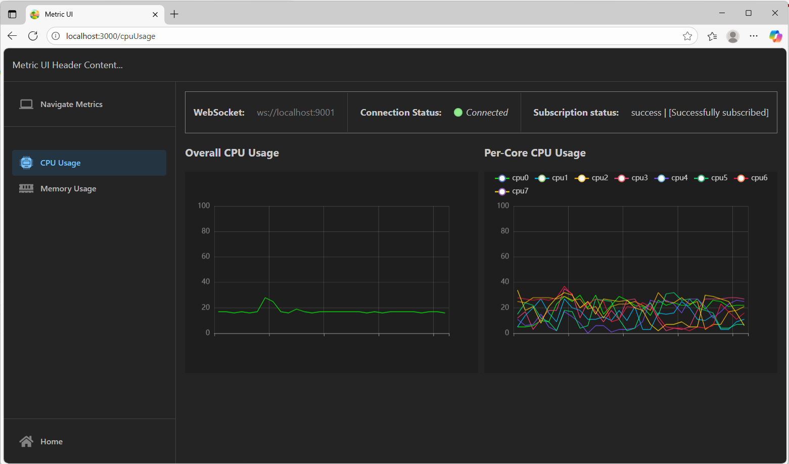
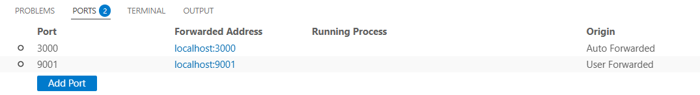

# C++ uWebSockets & React Streaming Chart

This project is a hands-on exploration of building a real-time, full-stack application with a C++ backend (for **Linux** systems) and a React frontend.<br>
The backend uses the high-performance uWebSockets library to stream system metrics (CPU and memory usage) over a WebSocket connection. <br>
The frontend is a React application that visualizes this data in a live, streaming chart.

## Motivation

The primary goal of this project was to learn and demonstrate the integration of a high-performance C++ backend with a dynamic React frontend. Key learning objectives included:

-   Using the uWebSockets library for efficient WebSocket communication.
-   Implementing a component-based architecture in React with a mix of TypeScript and JavaScript.
-   Trying out TanStack as a full-stack Framework for React.
-   Utilizing TanStack Router for efficient routing and navigation in React application.
-   Creating a live-updating chart to visualize a real-time data stream.

## Features

-   **Real-time Metrics:** Streams CPU and Memory usage from the server.
-   **High-Performance Backend:** C++ server built with uWebSockets.
-   **Dynamic Frontend:** React UI, Mantine UI, and TanStack Router for routing.
-   **Interactive Charts:** Live charts using Apache Echarts react wrapper.

## Technology Stack

| Area      | Technology                                       |
| :-------- | :----------------------------------------------- |
| **Backend** | C++20, uWebSockets, nlohmann/json                |
| **Frontend**| React, TypeScript, Vite, TanStack Router, ApacheEharts,...|
| **Build**   | CMake (for C++), npm (for React)                 |

## Getting Started

### Prerequisites

-   A C++ compiler supporting C++20 (e.g., GCC 10+ or Clang 12+)
-   CMake (version 3.15+)
-   Node.js (version 18+) and npm
-   Git

### 1. Clone the Repository

```bash
git clone https://github.com/vadakum/cpp_uwebsock_react_linux_metrics.git
cd cpp_uwebsock_react_linux_metrics
```

### 2. Build and Run the C++ Server

The server provides the WebSocket stream of system metrics.
Checkout the <b>[README.md](cppserver/README.md)</b> in the <b>cppserver</b> directory for more details.


### 3. Build and Run the React Frontend

The UI connects to the server and displays the data.

```bash
cd metricui
npm install
npm run dev
```

The development server will start. Open your browser to the URL shown in the terminal to see the application.
<div>

</div>
My backend (cppserver) was running on a vm, so vscode port forwarding helped
<div>

</div>


### Refrences
- [Tanstack Start](https://tanstack.com/start/latest/docs/framework/react/build-from-scratch) and [Tanstack Router](https://tanstack.com/router/latest/docs/framework/react/overview) - are nice to get started with buiding React App.
- [Mantine](https://mantine.dev/) - for UI components.
- [Apache Echarts](https://echarts.apache.org/en/index.html) and [React Echarts](https://github.com/hustcc/echarts-for-react) - for Charts.

