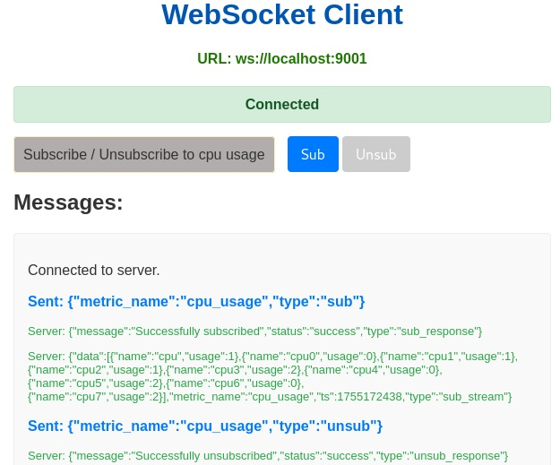

# C++ Metrics Server

This is a fun websocket server built with C++ and the uWebSockets c++ library. <br>
Its purpose is to collect system metrics (CPU and memory usage) on linux based systems and stream them to connected clients over websockets.


## Dependencies

-   **[uWebSockets](https://github.com/uNetworking/uWebSockets):** A highly scalable and efficient WebSocket and HTTP server library. We can either add its as a Git submodule or install it system-wide as detailed below => [Manual Installation of uWebSockets](#manual-installation-of-uwebsockets).
-   **[nlohmann/json](https://github.com/nlohmann/json):** A popular C++ library for JSON manipulation. It is included directly in the `include/tp` directory.

## Platform

**Note:** This server is designed specifically for **Linux**. It gathers metrics by reading from the `/proc/stat` and `/proc/meminfo` pseudo-files (part of /proc virtual filesystem).

## Building

To build the server, you will need a C++ compiler that supports C++20 and CMake.

### 1. Clone the repo
### 2. Install Dependencies 
The main dependency is the uWebSockets library => [Manual Installation of uWebSockets](#manual-installation-of-uwebsockets).
### 3. Build the Server

```bash
cd cppserver
mkdir build
cd build
cmake ..
make
```

This will create an executable named `cppserver` in the `build` directory.

### 4. Run the Server

```bash
./cppserver -p 9001 # ./cppserver -h for help
or 
./cppserver -p 9001 -v # for verbose output
```

The server will start and listen for WebSocket connections on the port specified in the command line arguments.

## Usage / Simple Test Client

Open `./cppserver/examples/cppserver_client.html` in the browser.
The url of the client is (in the `<script>` tag):
```
const websocketUrl = 'ws://localhost:9001'; 
```
<div>

</div>


## Manual Installation of uWebSockets

The following notes describe how to perform a manual, system-wide installation of uWebSockets.

### 1. Clone and Build uWebSockets

```bash
git clone --recurse-submodules https://github.com/uNetworking/uWebSockets.git
cd uWebSockets
git checkout v20.74.0 # Checkout the version used in this project
make examples
# Or, to build with OpenSSL support:
# WITH_OPENSSL=1 make examples
```

### 2. Install Manually

The default `make install` may not copy all necessary files. You might need to copy them manually:

```bash
sudo make install
# I had to copy the uSockets library header and static library
sudo cp uSockets/src/libusockets.h /usr/local/include/uWebSockets/
sudo cp uSockets/uSockets.a /usr/local/lib/libuSockets.a
```

### 3. Test Installation

You can verify the installation by compiling one of the examples:

```bash
cd examples
# If built with SSL support, add -lssl, install Zlib as well
g++ EchoServer.cpp -o ./echo_server -std=c++20 -I /usr/local/include/uWebSockets/ -L /usr/local/lib/ -l uSockets -lz
./echo_server
```